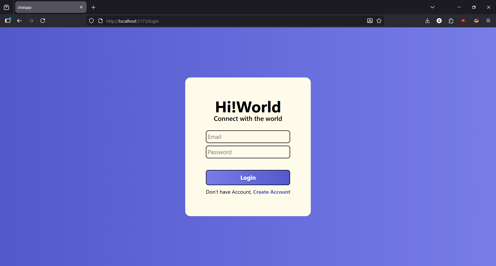
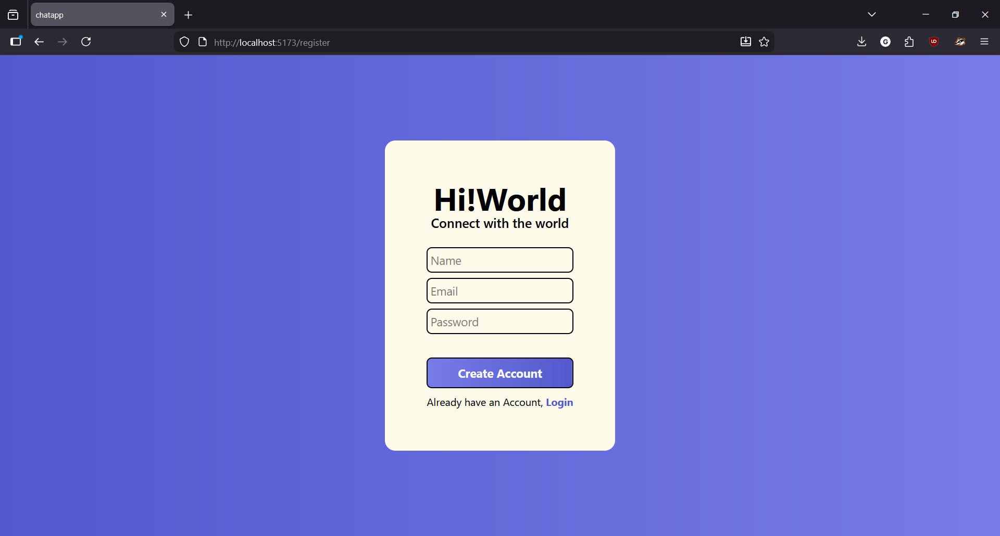
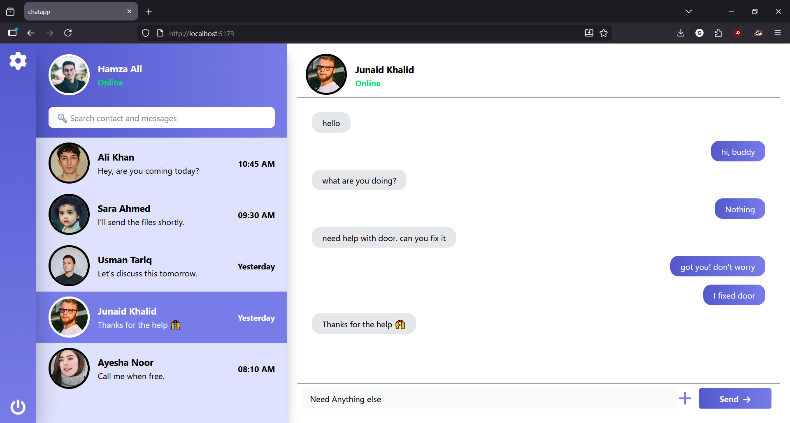

---

# 💬 Real-Time Chat Application (MERN Stack)

A real-time web chat application that enables users to communicate instantly with one-to-one messaging, authentication, file sharing, and live message updates using **Socket.io**.

---

## 🚀 Features

* 🔐 User Authentication (JWT-based)
* 💬 One-to-One Real-Time Messaging
* ⚡ Instant message delivery using Socket.io
* 🟢 Online / Offline user status
* 👁️ Message Seen & Delivered status
* 📁 Image / File sharing (local storage)
* 🌙 Dark Mode support
* 📱 Responsive UI for all screen sizes
* 💾 Message persistence with MongoDB

---

## 🛠️ Tech Stack

### Frontend

* React.js
* React Router
* Redux Toolkit
* TanStack Query (React Query)
* Tailwind CSS
* Axios
* Socket.io Client

### Backend

* Node.js
* Express.js
* MongoDB + Mongoose
* JWT (Authentication)
* Bcrypt (Password hashing)
* Multer (File uploads)
* Socket.io

---

## 📂 Project Structure

```
chat-app/
├── server/        # Backend (Node + Express)
│   ├── controllers
│   ├── models
│   ├── routes
│   ├── middleware
│   └── socket
│
├── client/        # Frontend (React)
│   ├── src/
│   │   ├── pages
│   │   ├── components
│   │   ├── redux
│   │   ├── services
│   │   └── utils
│
└── README.md
```

---

## 🔑 Authentication Flow

1. User registers or logs in
2. Server generates a JWT token
3. Token is stored on the client
4. Protected routes verify token before access
5. Socket connection is established after authentication

---

## 🔄 Real-Time Messaging Flow

1. User sends a message
2. Message is saved in MongoDB
3. Message is emitted via Socket.io
4. Receiver gets the message instantly
5. Message status updates (sent → delivered → seen)

---

## 📡 API Endpoints (Example)

### Auth

* `POST /api/auth/register`
* `POST /api/auth/login`

### Chat

* `GET /api/chats`
* `POST /api/messages`
* `GET /api/messages/:chatId`

---

## ⚙️ Installation & Setup

### 1️⃣ Clone the repository

```bash
git clone https://github.com/your-username/chat-app.git
cd chat-app
```

### 2️⃣ Backend Setup

```bash
cd server
npm install
npm run dev
```

Create a `.env` file:

```env
PORT=5000
MONGO_URI=your_mongodb_url
JWT_SECRET=your_secret_key
```

### 3️⃣ Frontend Setup

```bash
cd client
npm install
npm run dev
```

---

## 🌐 Environment Requirements

* Node.js v18+
* MongoDB (Local or Atlas)
* Modern browser (Chrome / Firefox)

---

## 📸 Screens

<table>
<tr>
<td>
  
### 🔐 Login Page


</td>
<td>
  
### 🙍‍♂️ Signup Mode


</td>
<td>
  
### 💬 Chat Page


</td>
</tr>
</table>


---

## 🎯 Future Improvements

* Group chats
* Voice & video calling
* Push notifications
* Message reactions
* Cloud file storage (S3 / Firebase)

---

## 🤝 Contributing

Contributions are welcome!
Feel free to fork the repo, create a branch, and submit a pull request.
Keep in mind this Project is not complate as many functional piece ofcode are remaining.

---

## 📄 License

This project is licensed under the MIT License.


---

If you want, I can:

* Simplify this README for **FYP submission**
* Rewrite it for **resume / portfolio**
* Add **badges**, **screenshots**, or **deployment instructions**

Just tell me 👍
